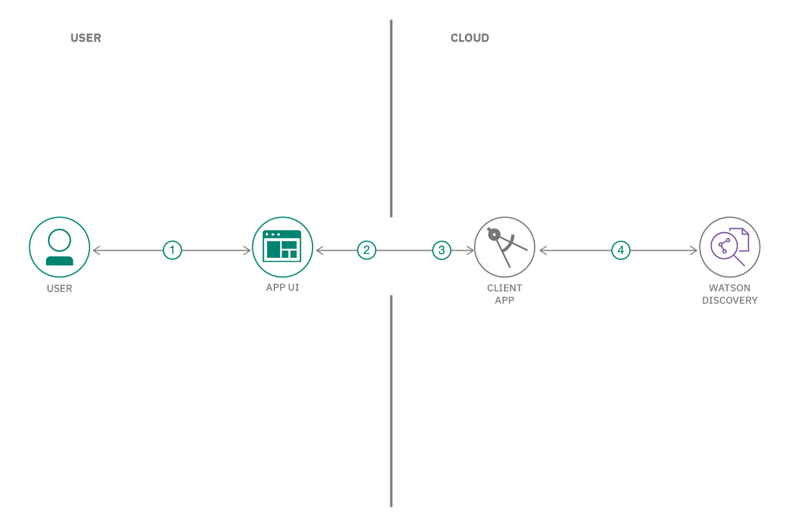
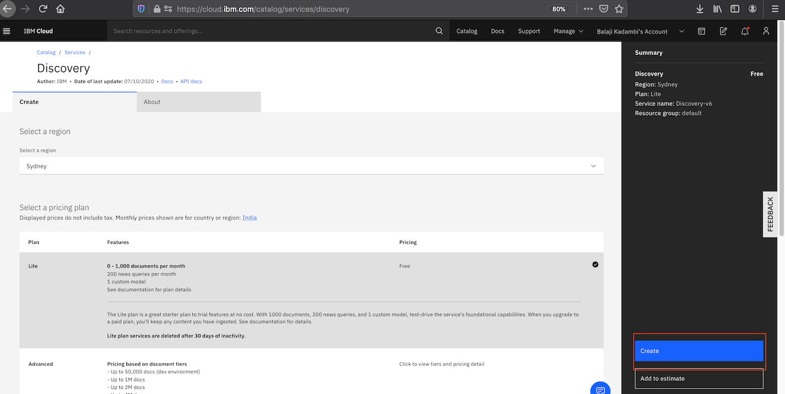
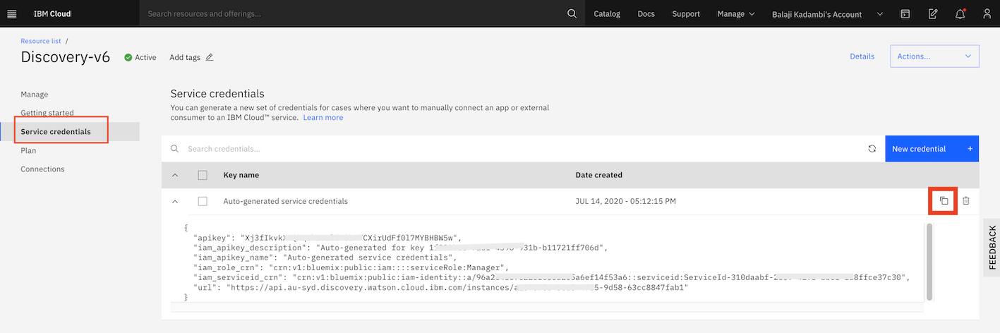
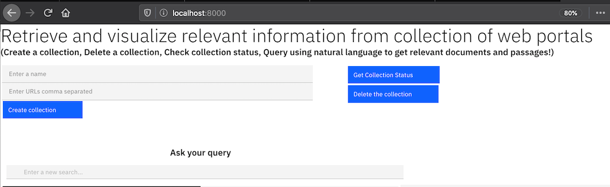
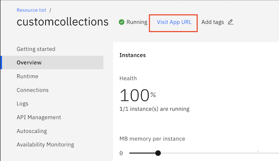

## Work in progress
# Retrieve relevant information from a collection of web portals and visualize them

There is a lot of information on the web, and we are always interested in getting the relevant information. The below two common scenarios drive the need for it:
- There is usually a specific item of interest, and we try to get all the relevant infomration about the item. 
- We have a question and are searching to find the answers for it that is in the web pages. 

In this code pattern, we try to address a specific scenario where we try to query for relevant information from a group of web pages. 
[IBM Discovery service](https://cloud.ibm.com/docs/discovery?topic=discovery-about) provides the ability to crawl through web pages and build a queryable collection. We will use this feature to build an application using which you can:
- Specify a list of URLs that `Discovery` will crawl to build the collection.
- Specify a query in `natural language` and get relevant results with insights from `Discovery`.

When you have completed this code pattern, you will understand how to:
- Use the `Discovery` APIs -
  - to create a collection using webcrawl.
  - to get the status of a collection.
  - to delete a collection.
- Parse, read and visualize the results from `Discovery`.

## Flow



1. User requests for creation/status/deletion of a collection or queries a collection through a custom built web UI.
2. The request is sent to a server application on the cloud.
3. The application invokes an api on the Discovery service using the Watson SDK.
4. The Discovery service processes the results and sends it back to the User.

## Prerequisites

- [IBM Cloud account](https://cloud.ibm.com)
- [Install IBM Cloud CLI](https://cloud.ibm.com/docs/cli?topic=cli-install-ibmcloud-cli)
- [Python](https://www.python.org/downloads/)

## Steps

1. [Clone the repo](#1-clone-the-repo)
1. [Deploy the application](#2-deploy-the-application)
1. [analyze-the-results](#3-analyze-the-results)

## 1. Clone the repo

Open a terminal and run the below command to clone the repo.

```
git clone https://github.com/IBM/discovery-webcrawl-insights
```
This will create a folder `discovery-webcrawl-insights`.

## 3. Deploy the application

### Deploy the application locally

Click [here](https://cloud.ibm.com/catalog/services/discovery) to create an instance of the `Discovery` service.

Select a region and pricing plan. Click `Create`.



>Note: The below step is need if you are deploying the application locally. Skip the below step if you are deploying the application to the cloud.
Once the service is provisioned, open the service page and click on `Service credentials`. Click on `Copy` icon to copy the credentials.
Go to the repo folder `discovery-webcrawl-insights`, edit the file `credentials.json` and replace content with new credentials you copied.



You can optionally use a [virtual environment](https://packaging.python.org/installing/#creating-and-using-virtual-environments) to avoid having these dependencies clash with those of other Python projects or your operating system.

Install the dependencies listed in the requirements.txt file to be able to run the app locally. Open a terminal. Go to the repo folder `discovery-webcrawl-insights` and run the below command.
```
pip install -r requirements.txt
```
Run the application with the below command:
```
python mydiscovery.py
```
The application can be accessed at http://localhost:8000.



### Deploy the application on IBM Cloud

Open a terminal. Go to the repo folder `discovery-webcrawl-insights` and run the below commands.

```
$ ibmcloud cf create-service discovery lite mydiscoveryservice
$ ibmcloud cf push
$ ibmcloud cf bind-service customcollections mydiscoveryservice
$ ibmcloud cf restage customcollections
```

Once the application is deployed and running fine, go to the IBM Cloud Dashboard. 

On the application dashboard, select `Connections`. Click on `Create connection`.


Choose the `Discovery service` you created earlier.


Create the connection. The application must be re-staged after that.


Click on `Visit App URL` to access the application.


## 4. Analyze the results

You can now go ahead and create a collection. 


## License

This code pattern is licensed under the Apache License, Version 2. Separate third-party code objects invoked within this code pattern are licensed by their respective providers pursuant to their own separate licenses. Contributions are subject to the [Developer Certificate of Origin, Version 1.1](https://developercertificate.org/) and the [Apache License, Version 2](https://www.apache.org/licenses/LICENSE-2.0.txt).

[Apache License FAQ](https://www.apache.org/foundation/license-faq.html#WhatDoesItMEAN)
